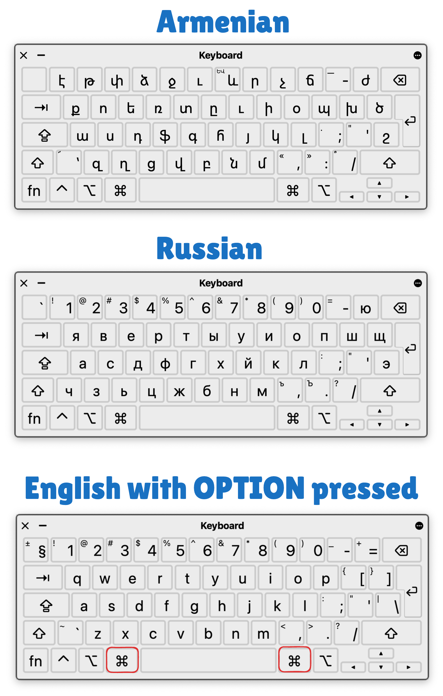

# ChiliKeys
### Armenian and Russian phonetic keyboard layouts for macOS, inspired by KDWin



## ✨ Key Features

🔤 **Phonetic Layouts**
- Armenian and Russian layouts following KDWin style
- Familiar typing experience for KDWin users

⚡ **Quick Language Switch**
- Hold **Option** key for instant English access
- Hold **Option** + **Shift** to access Special Characters like Parentheses ( )
- Perfect for mixed-language typing

## 🚀 Quick Install

```bash
brew tap sergchil/chilikeys https://github.com/sergchil/chilikeys && brew install chilikeys
```

## 📖 Installation Options

<details>
<summary>📦 Homebrew (Recommended)</summary>

1. Install with Homebrew:
   ```bash
   brew tap sergchil/chilikeys https://github.com/sergchil/chilikeys
   brew install chilikeys
   ```

2. To uninstall:
   ```bash
   brew uninstall chilikeys
   brew untap sergchil/chilikeys
   ```
</details>

<details>
<summary>💿 Manual Installation (DMG)</summary>

1. Download [latest release](https://github.com/sergchil/chilikeys/releases)
2. Open the DMG file
3. Copy bundles to `~/Library/Keyboard Layouts/`
4. Restart your Mac
</details>

## 🛠️ For Developers

<details>
<summary>Release Process</summary>

1. Run version bump script:
   ```bash
   ./bump_version.sh
   ```
   - Use ↑/↓ to choose version
   - Press Enter to select
   - Confirm with 'y'

2. GitHub Actions will handle the release automatically
</details>
